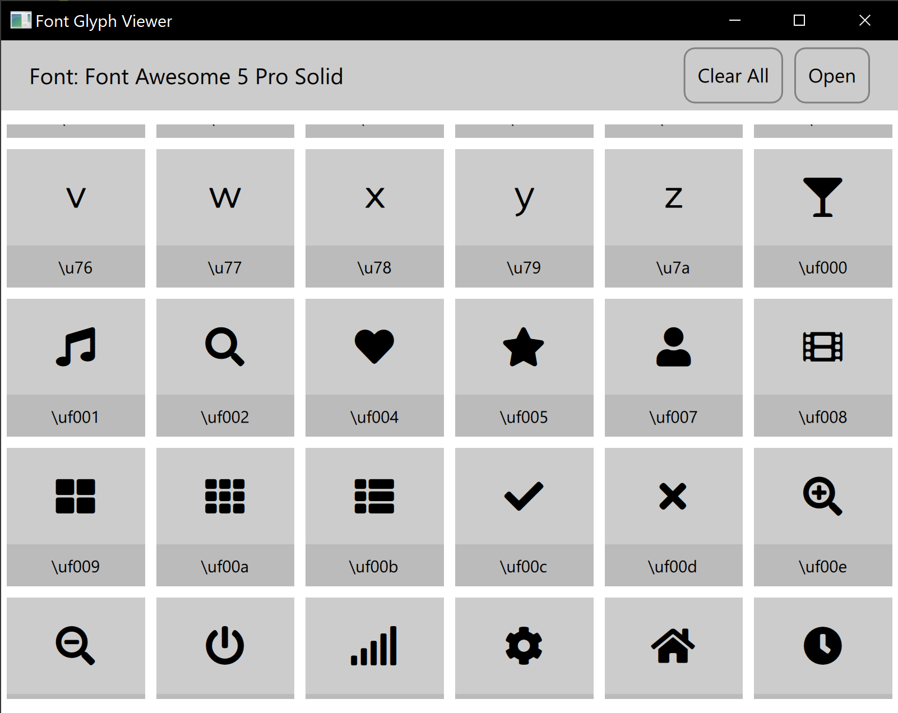

# QML Based Font Glyphs Viewer
The application allows for loading of ttf/otf based font formats for viewing as well as copying the unicode character associated with a specific glyph. This is importantif you are trying to figure out what a specific icon font contains or the specific unicode to use in order to utilize font icons.

Font icons are popular way of distributing and embedding vector based icons. Some popular font based icon sets include [Font Awesome](fontawesome.com), [Material Fonts]() and so much more!

# Usage
Still in development

# Documentation
Coming soon

# Contributing
Open an issue
