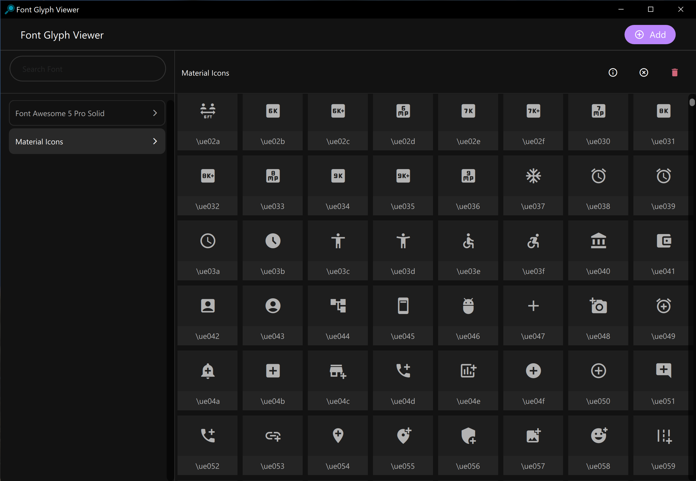

# QML-Based Font Glyphs Viewer

## Introduction

Welcome to the QML-Based Font Glyphs Viewer! This application is an essential tool for designers, developers, and typography enthusiasts. It facilitates the loading and viewing of TTF/OTF-based font formats, specializing in the display and utilization of font glyphs. Particularly useful for deciphering the contents of icon fonts and determining specific Unicode representations for font icons, our software simplifies the process of exploring and employing vector-based iconography.

Font icons have become a widely adopted method for distributing and embedding scalable, vector-based icons. They offer a range of benefits, including versatility and ease of integration. Some renowned font-based icon sets that you might be familiar with include [Font Awesome](www.fontawesome.com) and [Material Fonts](https://pictogrammers.com/library/mdi/), among many others.

## Building & Running the Application

### Beta Versions
You can find beta versions of the application in the [releases section](https://github.com/allankoechke/FontGlyphViewer/releases) as a downloadable ZIP file. Presently, these releases cater to Windows users, with plans to extend support to other platforms in the future.

### Building from Source
For those interested in compiling and running the application from source, follow these steps:

- Ensure you have the Qt 6 build system. This requires Qt Creator with Qt version 6.4 or later.
- Open the `CMakeLists.txt` file in Qt Creator and execute the project.
- For users working with Qt 5.15, some adjustments will need to be made in the CMake file.

## User Guide

Utilizing the QML-Based Font Glyphs Viewer is straightforward:

1. Launch the application.
2. Click on the `Add` button to import font files into the software.
3. Scroll through the displayed catalog to view available glyphs.
4. To copy a glyph's Unicode to the clipboard, simply click on the Unicode display.
5. Alternatively, click on a glyph to open its popup, then use the copy button below to copy its Unicode.
6. The `(X)` button clears the currently selected font.
7. The `(Delete)` button removes the currently selected font from the model.

## Contributing

Your contributions are what make the QML-Based Font Glyphs Viewer a continually improving tool. Whether you have ideas for new features, optimizations, or fixes, your input is greatly valued.

- To suggest changes or report issues, please [open an issue](https://github.com/allankoechke/FontGlyphViewer/issues).
- To propose enhancements or direct code contributions, feel free to [create a pull request](https://github.com/allankoechke/FontGlyphViewer/pulls).

We look forward to your innovative ideas and contributions!